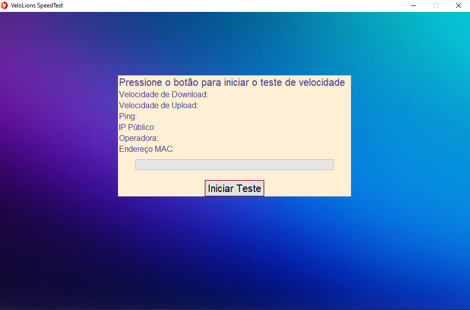

<h1 align="center" style="font-weight: bold;">Velolions Speedtest 💻</h1>

    <b>Project developed to test speed, upload and collect MAC address information.</b>

<h2 id="layout">🎨 Layout</h2>

    
    

<h2 id="technologies">💻 Technologies and Prerequisite  </h2>

- Python
- Speedtest
- Requests
- Subprocess
- Tkinter

<h3>Prerequisites</h3>

- [Python 3.12](https://www.python.org/downloads/)

